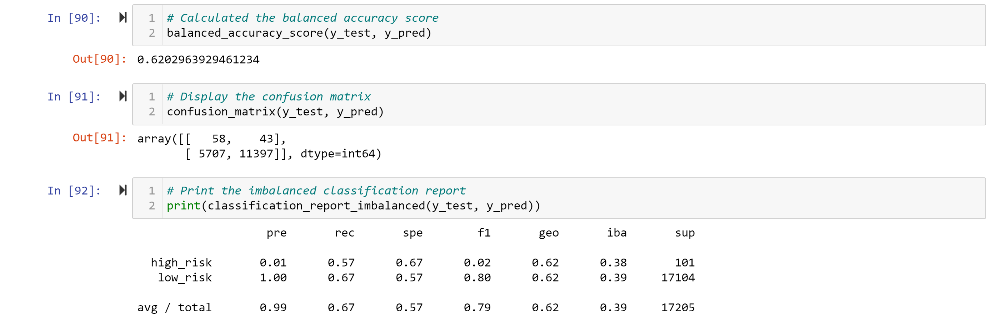
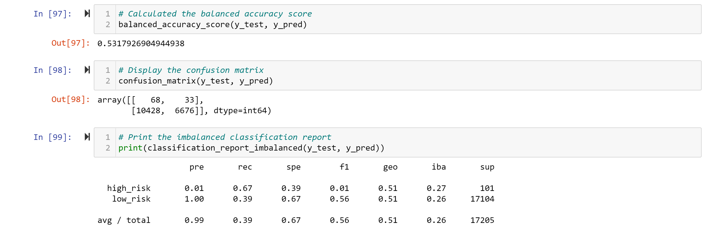
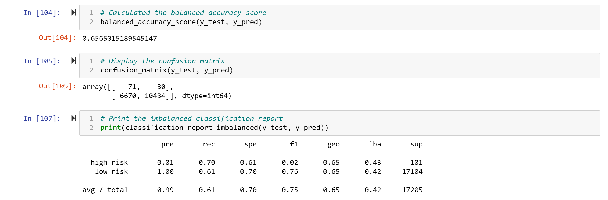
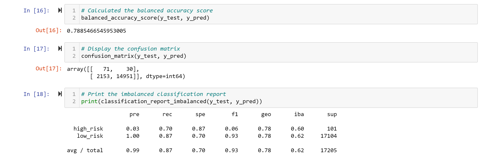
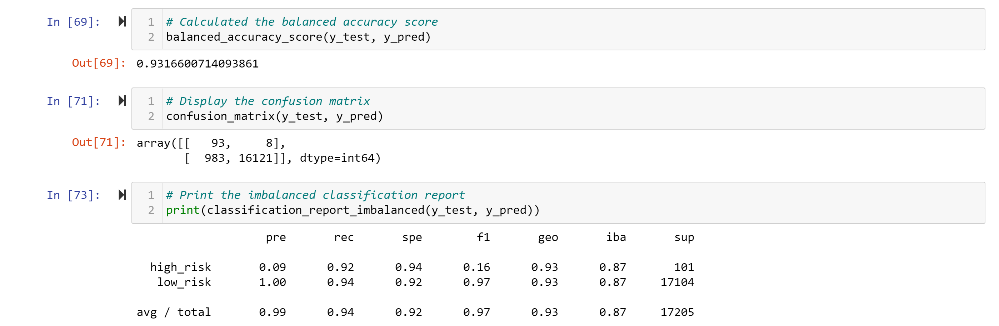
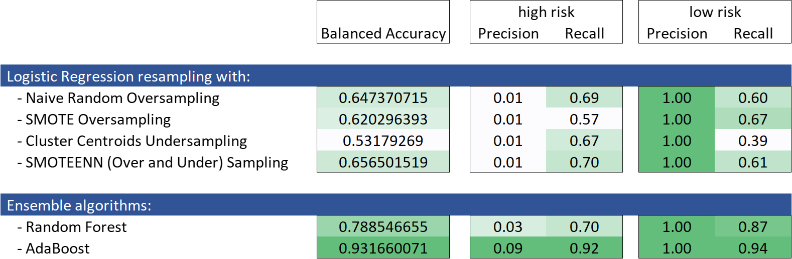

# Credit_Risk_Analysis

## Overview

The purpose of the analysis is to compare different techniques to assess credit card risk, which is inherently an unbalanced classification problem

### Tools

- Jupyter notebook
- Python:
  - numpy
  - pandas
  - pathlib
  - collections
  - imbalanced-learn
  - scikit-learn

## Results

- Six techniques were explored:
  - Logistic Regression resampling with:
    - Naive Random Oversampling
    - SMOTE Oversampling
    - Cluster Centroids Undersampling
    - SMOTEENN (Over and Under) Sampling
  - Ensemble algorithms:
    - Random Forest
    - AdaBoost

### Logistic Regression resampling

#### Naive Random Oversampling

#### SMOTE Oversampling

#### Cluster Centroids Undersampling

#### SMOTEENN (Over and Under) Sampling

### Ensemble algorithms

#### Random Forest

#### AdaBoost

### Resume

- AdaBoost seems to be the best alternative as:
  - It has the best Balanced Accuracy
  - Precision (TruePositive / (TruePositive + FalsePositive)) for high-risk cases is higher
  - And most important for this case of credit risk, Recall (TruePositive / (TruePositive + FalseNegative)) is higher

## Summary

- From this analysis the AdaBoost algorithm is recommended to assess credit risk as it has better performance in all three critical indicators: Balanced Accuracy, Precision and Recall.
