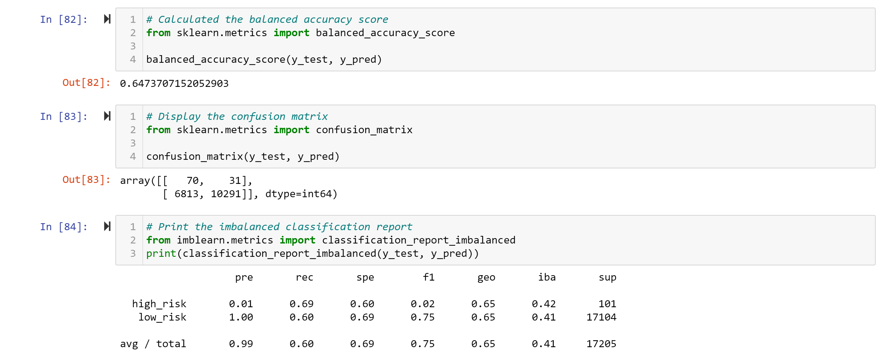

# Credit_Risk_Analysis

## Overview

The purpose of the analysis is to compare different techniques to asess credit card risk, wich is inherently an unbalanced clasification problem

### Tools

- Jupyter notebook
- Python:
  - numpy
  - pandas
  - pathlib
  - collections
  - imbalanced-learn
  - scikit-learn

## Results

- Six techniques were explored:
  - Logistic Regression resampling with:
    - Naive Random Oversampling
    - SMOTE Oversampling
    - Cluster Centroids Undersampling
    - SMOTEENN (Over and Under) Sampling
  - Ensemble algorithms:
    - Random Forest
    - AdaBoost

### Logistic Regression resampling

#### Naive Random Oversampling

#### SMOTE Oversampling

#### Cluster Centroids Undersampling

#### SMOTEENN (Over and Under) Sampling

### Ensemble algorithms

#### Random Forest

#### AdaBoost

### Resampling Models to Predict Credit Risk

Using bulleted lists, describe the balanced accuracy scores and the precision and recall scores of all six machine learning models. Use screenshots of your outputs to support your results.

## Summary

Summarize the results of the machine learning models, and include a recommendation on the model to use, if any. If you do not recommend any of the models, justify your reasoning.
